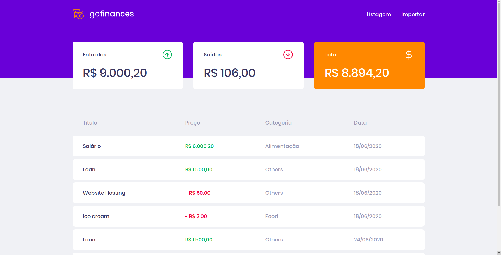

<h1 align="center">
GoFinances
</h1>
<p align="center">Applicantion to control money balance.</p>



---

## 🚀 Getting Started

### 1. Clone it!

  ```git clone https://github.com/davim5/GoFinances.git```

### 2. Go to the right directory!

  ```cd GoFinances```

### 3. Install Dependencies!

  ```yarn```

### 4. Run it!

  ```yarn start```

### 5. Turn on the Backend

  on https://github.com/davim5/desafio-backend

### 6. Enjoy it!

Runs the app in the development mode.<br />
Open [http://localhost:3000](http://localhost:3000) to view it in the browser.
